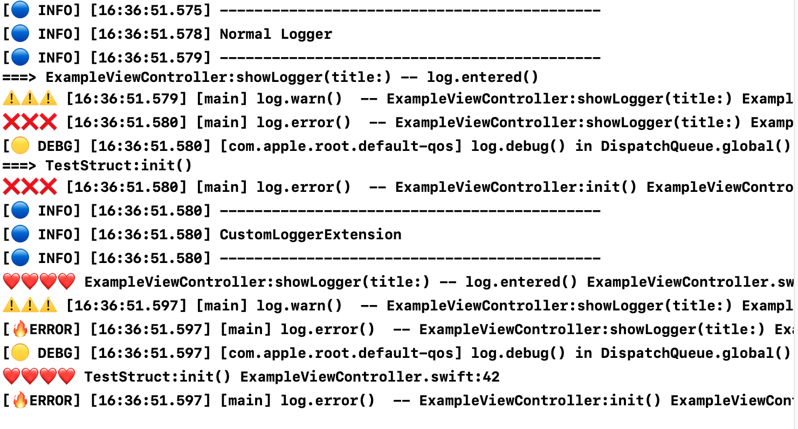

# Logger

**Simple and customizable log library for iOS**



Logger is simple and customizable.
You could inject Logger's dependency with  LoggerDependency protocol.

Below code  is LoggerDependency.

```swift
public protocol LoggerDependency {
    func log(level: Logger.Level, message: String, formattedMessage: String)
    func preFix(_ level: Logger.Level) -> String
    func isEnabled(_ level: Logger.Level) -> Bool
    func getTimeStampType(_ level: Logger.Level) -> Logger.TimeStampType
    func isEnabledThreadName(_ level: Logger.Level) -> Bool                             // Thread Information
    func isEnabledClassAndMethodName(_ level: Logger.Level) -> Logger.DescriptionType   // Class/Function Information
    func isEnabledFileAndLineNumber(_ level: Logger.Level) -> Bool                      // File/Line Information
    func sepalator() -> String
    func sepalator2() -> String
}

```


If you implement log(), you could output strings for log to anywhere.

We could change prefix like above picture with preFix().